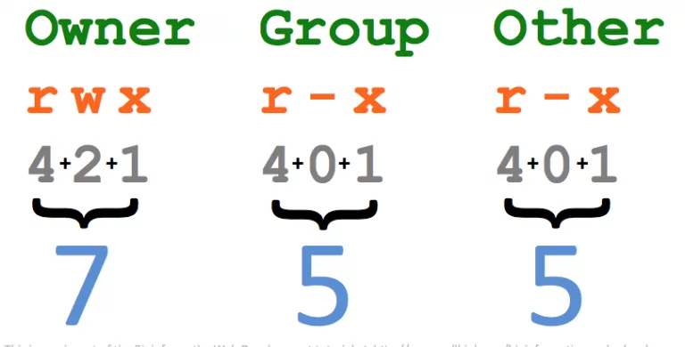
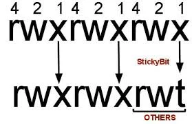
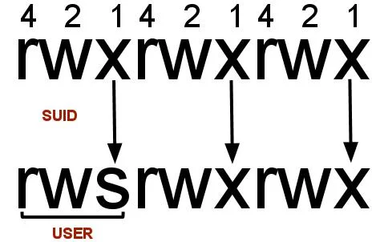
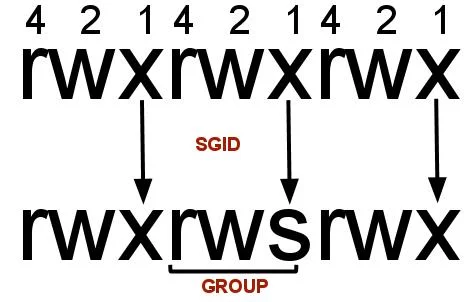

The **Linux Foundation** is a nonprofit organization that sponsors the work of Linux creator Linus Torvalds. It was founded in 2000 and its mission is to promote, protect, and advance Linux. The Linux Foundation is supported by leading technology companies and thousands of individual members from around the world and marshalls the resources of its members and the open source development community to ensure that Linux remains free and technically advanced.

## Sejarah Linux

Linus Tovarlds membuat sendiri sebuah proyek tahun 1991 sistem operasi kernel. Tahun 1992 Linux merubah lisensi menjadi General Public License (GPL) oleh GNU( sebuah proyek Free Software Foundation(FSF) dimana mempromosikan freely perangkat lunak yang tersedia)

## Mengenal Linux

Linux adalah sebuah sistem operasi yang berbasis Unix yang disebarluaskan ke masyarakat secara gratis dan berada di bawah lisensi GNU General Public License (GPL), yang berarti bahwa Linux didistribusikan berikut dengan source code-nya. Ketersediaan akses kode sumber memungkinkan para pengguna untuk memodifikasi sistem operasi ini yang kemudian diperbolehkan juga untuk digunakan dan didistribusikan kembali secara bebas.
Yang menjadi perbedaan paling utama antara sistem operasi Linux dengan sistem operasi populer lainnya adalah terletak pada kernel Linux dan komponen-komponen penyusun yang bisa diakses secara bebas dan terbuka. Sayangnya, Linux bukanlah satu-satunya sistem operasi yang berada pada kategori open source. Akan tetapi Linux menjadi contoh terbaik dan sistem operasi open source yang paling banyak digunakan. Sistem operasi Linux sendiri dapat di unduh secara bebas di internet, atau melalui forum-forum khusus.

## Kelebihan dan Kekurangan Linux

#### Kelebihan

Kelebihan Linux selain dapat di unduh secara gratis di internet, Linux juga bisa di kembangkan dan di distribusikan ulang (open source), bersifat freeware, hanya perlu minimal perangkat keras (hardware) dan dapat berjalan di mesin kecil maupun besar. Tak hanya itu, kehandalan Linux juga cukup diandalkan oleh NASA dalam sebuah penelitian di luar angkasa yang membutuhkan kestabilan system tingkat tinggi. Linux juga diketahui sangat kebal terhadap virus dibandingkan sistem operasi lain seperti DOS. Hal ini membuat system keamanan Linux cukup terjamin.

#### Kekurangan

Disamping kelebihan Linux, terdapat beberapa kekurangan yang terdapat pada sistem operasi gratis ini. Tak seperti Windows, orang awam biasanya akan mengalami kesulitan saat pertama kali melakukan sistem operasi ini. Bahkan, beberapa jenis Linux masih belum optimal dalam penyajian WYSYWYG (What You See is What You Get). Namun kelemahan ini sekarang sudah mulai diperbaiki dan kita sudah bisa menggunakan sistem operasi Linux yang benar-benar telah mendekati nilai sempurna.


## Filosofi

Dibuat secara bersama sama walaupun terpisah oleh jarak, geografi dan lebih dari 8000 pengembang ikut kontribusi dalam Linux Kernel.

### Linux menggunakan GPL lisensi.

- Kebebasan untuk menggunakan perangkat lunak untuk tujuan apapun

- Kebebasan untuk merubah perangkat lunak agar sesuai kebutuhan

- Kebebasan untuk membagikan perangkat lunak kepada kawan atau tetangga

- Kebebasan untuk membagikan perubahan yang telah dibuat

## Linux Terminologi

- Kernel : Otak dari Linux Operation Sistem. Yang mengkontrol hardware untuk berinteraksi dengan aplikasi.

- Boot Loader : Program untuk boots Sistem Operasi. Contohnya GRUB dan ISOLINUX

- Service : Program yang menjalankan sebagai background process.
```bash
Init menjadi 4 yaitu httpd webserver, ftpd ftp FTPserver ,named Name Server,dhcpd DHCP server
```
- filesystem : method untuk menyimpan dan mengordinasikan file. Contohnya Ext4,ext3,FAT,XFS dan Btrfs

- X Windows System : Standart toolkit dan protocol untuk membuat GUI di Linux System.

- Dekstop Environtment : GUI di top of sistem operasi.GNOME,KDE,Xfce dan Fluxbox

- Command Line : Antarmuka untuk mengetikan perintah di top sistem operasi

- Shell : Command Line Menerjemahkan untuk masukan dan instruksi kepada sistem operasi agar melakukan perintah dan tugas. Contoh bash, zsh dan tcsh

## Macam Jenis Sistem Operasi Linux
1. Red Hat Linux
2. Debian Linux
3. Ubuntu Linux
4. Linux Mint
5. Fedora Linux
6. SuSE Linux
7. CentOS Linux
8. Slackware Linux

## Perintah Dasar Linux

- man <perintah> untuk meilhat panduan

Melihat kegunaan dari perintah (melihat buku manual dari sebuah program). Contohnya seperti | $ man apt | akan menampilkan manual penggunaan dari program apt.
-  <perintah> –help untuk panduan ringkas

Hampir sama kegunaannya dengan man, akan tetapi hasil yang dimunculkan lebih ringkas daripada menggunakan perintah man.
- sudo untuk super user

Menjalankan program sebagai user root atau super user.
- ls untuk melihat direktori

Melihat daftar file & folder yang ada direktori pada saat itu, contohnya | $ ls /var/lib | digunakan untuk melihat apa saja yang ada pada folder lib.
- cd untuk masuk ke direktori

Masuk ke direktori yang diinginkan, contohnya seperti | $ cd /home/ | untuk menjadikan folder home sebagai direktori pada saat itu.
- mkdir <nama folder> untuk membuat folder

Membuat folder pada direktori kerja pada saat itu.
- pwd untuk melihat direktori aktif

Melihat direktori kerja yang pada saat itu aktif. Contoh hasilnya “/home/niagahoster”
- vim untuk membuka text editor

Membuka text editor Vim untuk mengedit teks.
- cp <asal> <tujuan> untuk menyalin file

Menyalin file dan folder, bisa ke folder itu juga atau ke folder yang lain. Seperti | $ cp /home/test.php /var/www/html | akan memindahkan file test.php ke folder html. Sedangkan jika menyalin folder harus menggunakan opsi “-r”.
- mv <asal> <tujuan> untuk memindahkan folder

Memindahkan file dan folder, bisa ke folder itu juga atau ke folder yang lain. Seperti | $ cp /home/test.php /var/www/html | digunakan untuk memindahkan file test.php ke folder html.
- rm <file> untuk menghapus file

Menghapus file, bisa juga untuk menghapus folder pada direktori tertentu.
- find <nama file> untuk mencari file

Mencari file dalam direktori hirarki. Contoh penggunaannya | $ find -name niagahoster.txt |
- history untuk melihat riwayat

Perintah dasar linux ini digunakan untuk melihat riwayat perintah yang sudah pernah digunakan sebelumnya. Jika ingin mencari perintah tertentu bisa menggunakan $ history | grep apt untuk mencari nama perintah yang sudah pernah diketikan dan mengandung potongan kata apt.
- menyatukan file dan menampilkan dalam output standar

Melihat isi dari sebuah file, bisa juga untuk menggabungkan isi dari dua buah file. Contohnya | $ cat niagahoster1.txt niagahoster2.txt |.
- echo untuk menampilkan baris teks

Perintah ini digunakan untuk menampilkan satu baris teks. Bisa juga untuk menuliskan sebuah teks kedalam file, contohnya seperti berikut | $ echo “Teks” >> niagahoster.txt |. Perintah tersebut akan menuliskan “Teks” ke dalam file “niagahoster.txt”, jika file tersebut belum ada maka otomatis akan dibuat.
- grep untuk mencari kata

Menampilkan baris yang mengandung kata yang sama sesuai dengan pattern, contohnya seperti | $ grep -i source niagahoster.txt | maka akan memunculkan baris yang mengandung kata “source” pada “niagahoster.txt”.
- wc untuk menampilkan baris baru

Menampilkan baris baru, kata, dan bite pada sebuah file.
- sort untuk mengurutkan

Mengurutkan hasil dari pembacaan isi file.
- chmod untuk mengganti hak akses

Mengganti hak akses pada sebuah file. Contohnya jika ingin menggani hak akses niagahoster.txt menjadi 644 menggunakan baris perintah | $ chmod 644 niagahoster.txt |.
- chown mengganti hak milik

Mengganti pemilik dan group dari sebuah file. Contohnya jika ingin mengubah kepemilikan niagahoster.txt menjadi “niaga” bisa menggunakan perintah | $ chown niaga:niaga niagahoster.txt |. Kata “niaga” di depan merujuk pada user sedangkan “niaga” di belakang merujuk pada nama group.
- su untuk mengganti user id

Mengganti user ID, contohnya | $ su <nama user> | atau menjadikan user pada saat itu menjadi super user.
- passwd untuk mengganti password

Perintah ini digunakan untuk mengganti password dari user. Mengetikan | $ sudo passwd | mengganti password user pada saat itu, sedangkan | $ sudo passwd niagahoster | digunakan untuk mengganti password user “niagahoster”.
- who untuk menampilkan user

Perintah dasar linux ini digunakan untuk menampilkan user pada saat ini dipakai.
- ps untuk menampilkan snapshot

Menampilkan snapshot process yang sedang berjalan.
- kill untuk menghentikan program

Menghentikan program yang berjalan dengan menggunakan signal. Biasanya perintah ini ditambahkan opsi “-9” pada saat mengeksekusi. Contohnya seperti | $ sudo kill -9 373 |, 373 adalah PID dari proses yang sedang berjalan.
- tar untuk mengumpulkan file

Ini merupakan program pengarsipan atau untuk mengumpulkan beberapa file menjadi satu file, dengan ekstensi “namafile.tar”. Perintah ini juga menggunakan beberapa opsi, sebagai contoh, opsi “c” untuk membuat arsip, opsi “v” untuk operasi verbose, sedangkan “f” untuk menentukan nama file.
- zip untuk mengkompres file

Alat kompresi file menjadi “,zip”, hampir sama penggunaannya dengan tar.
- unzip untuk mengekstrak file

Mengekstrak/membongkar file “.zip”.
- ssh untuk akses jarak jauh

Mengakses komputer/server dari jarak jauh. Contoh perintah yang bisa digunakan seperti | $ ssh <namauser>@<ip> |.
- scp untuk menyalin file

Menyalin file dari host lain yang terhubung dalam satu jaringan. Contohnya | $ scp <file> <user>@<ip>:<folder tujuan> |
- fdisk untuk menampilkan partisi

Menampilkan list partisi pada perangkat, biasanya menggunakan opsi “-l”, contohnya | $ sudo fdisk -l |
- mount untuk melampirkan file

Melampirkan sebuah filesystem kedalam satu folder besar. Sehingga tidak perlu melakukan akses langsung ke filesystem. Sebagai contoh menggunakan | $ sudo mount /dev/sda2 /mnt |. Perintah ini akan membuat isi partisi /dev/sda2 bisa diakses melalui /mnt.
- umount untuk melakukan unmount

Mengunlock perintah mount, contohnya | $ umount /mnt | digunakan untuk memutuskan perintah mount pada folder /mnt.
- du untuk menampilkan ukuran file

Menampilkan ukuran file secara rekursif.
- df untuk menampilkan disk space

Menampilkan penggunaan ruang disk pada filesystem.
- quota menampilkan sisa disk space

Menampilkan ruang disk dan batasannya.
- reboot untuk mulai ulang

Menjalankan perintah restart.
- poweroff untuk mematikan

Menjalankan perintah shutdown.
- gedit untuk membuka editor teks

Membuka Text Editor untuk mengedit teks file.
- kate untuk membuka teks editor

Program yang digunakan sebagai file editor pada KDE, beberapa sistem operasi harus melakukan instalasi terlebih dahulu. Fungsinya hampir sama seperti Gedit.
- bg membuat proses background

Membuat proses foreground untuk berjalan di background.
- fg <id program> membuat proses foreground

Membuat background proses menjadi foreground proses.
- jobs <id program> menampilkan identitas proses

Menampilkan nama dan ID dari background jobs.
- sed untuk melakukan filter teks

Memfilter teks pada sebuah file dan menggantinya dengan teks yang baru. Contoh penggunaannya sed | ‘s/niaga/hoster/g’ niagahoster.txt |
- awk untuk memindahkan teks

Perintah ini digunakan untuk memindah teks dan memproses bahasa.
- locate untuk mencari file

Digunakan untuk menemukan atau mencari file.
- ifconfig untuk melihat ip

Melihat IP yang sedang terkoneksi dan network device apa saja yang tersedia.
- date untuk menampilkan tanggal

Menampilkan tanggal hari ini.
- nano merubah teks editor

Perintah digunakan sebagai text editor yang tidak perlu membuka jendela baru. Hampir sama dengan Vi namun lebih praktis.
- top melihat proses secara urut

Melihat semua proses yang sedang berjalan, diurutkan dari proses yang paling besar. Fungsinya hampir sama seperti system monitor.
- clear membersihkan terminal

Membersihkan jendela terminal. Jadi isi jendela terminal akan kosong, namun jika di scroll keatas maka perintah yang sebelumnya dijalankan masih bisa terlihat.
- dpkg -i <namapackage>.deb instalasi paket

Berguna untuk melakukan instalasi paket dengan ekstensi “.deb”. Terkadang bisa juga menggunakan program “gdebi”, tetapi harus install.
- uname melihat versi kernel

Menampilkan versi kernel yang dipakai, tanggal instalasi, dan jenis arsitektur sistem operasi.
- * untuk mencantumkan deskripsi

Ini adalah sebuah tanda yang digunakan untuk mendeskripsikan satu string yang digunakan untuk memberikan deskripsi singkat dari satu elemen.

- tar mengarsipkan file

Penggunaan: tar [OPTION] DEST SOURCE Contoh: tar cvf /home/archive.tar /home/original tar xvf /home/archive.tar

- kate KDE Editor

Penggunaan: kate [options][file(s)] Contoh: kate file1.txt file2.txt

- find mencari dalam satu direktori

Penggunaan: find [OPTION] [path] [pattern] Contoh: find name file1.txt

- find mencari dalam satu direktori

Penggunaan: find [OPTION] [path] [pattern] Contoh: find name file1.txt

- less

less <file_name> mencetak halaman suatu file halaman demi halaman. Ini berguna dan efisien saat digunakan untuk melihat file besar yang berisi banyak data tekstual yang tidak muat di layar. Anda dapat menekan Ctrl + F untuk maju dan Ctrl + B untuk pergi ke belakang dalam satu halaman. Ini sama seperti Anda melihat isi dari file teks pada notepad atau editor teks lainya dan membaca file halaman demi halaman pada GUI.
- gzip

gzip <filename> membuat dan mengekstrak arsip gzip. Anda dapat menggunakan gzip -d <filename> untuk mengekstrak arsip gzip.
- help

<command_name> –help berisi semua perintah yang tersedia di terminal. Anda dapat menggunakan opsi “h” atau “help” (help memiliki dua tanda hubung di sini) opsi dengan perintah apapun untuk mendapatkan bantuan pada suatu perintah tertentu, contohnya jika kita ingin mengetahui perintah apa saja yang terhubung atau berkaitan dengan suatu perintah contohnya “cp –help” atau “cp -h” akan menampilkan opsi-opsi yang berhubungan dengan perintah “cp”.
- whatis

whatis <command_name> menunjukkan deskripsi single-line suatu perintah yang diberikan.

- Exit

exit mengakhiri suatu sesi pada terminal (bash) saat ini. Perinyah ini sama seperti Anda mengklik tombol tutup dalam title bar suatu aplikasi apapun untuk menutup aplikasi pada mode GUI.
- Ping

ping <remote_host_address> adalah prinyah untuk melakukan ping pada remote host (server) dengan mengirimkan paket ping. Hal ini dapat digunakan untuk memeriksa konektivitas atau status suatu jaringan dari server. Ini sama dengan Anda melakukan ping host menggunakan network manager di GUI.
- Free

free menampilkan informasi tentang free, used, swap memory yang tersedia (atau saat ini bebas) di sistem anda. Anda dapat menggunakan free -m untuk melihat memori di KBs.
- ps => proses

ps menampilkan informasi tentang proses yang berjalan dari sistem.
- top

top menunjukkan informasi tentang proses top dalam sistem (diurutkan berdasarkan penggunaan CPU secara default). Anda dapat menggunakan top -u <username> untuk melihat proses pada satu user. Ini sama seperti Anda melihat daftar proses atau aplikasi yang berjalan menggunakan task manager di GUI.
- shutdown

shutdown adalah perintah untuk menutup atau mematikan komputer Anda. Anda dapat menggunakan shutdown -r untuk me-restart komputer Anda.

- apropos [suatu yang berhubungan dengan perintah]

mencari perintah berdasarkan suatu

- rm –Rf

akan menghapus setiap direktori yang Anda tentukan.

- cat [nama file] untuk melihat isi file

- more [nama file] untuk melihat isi file layar per layar

- less [nama file] untuk melihat isi file baris per baris

- pipeline/vertical bar untuk menggabungkan dua perintah

- clear untuk membersihkan terminal

- which [nama file] untuk mencari file

- cp –r untuk akan menyalin setiap file dalam direktori yang Anda tentukan.

- wc [nama file] untuk menghitung baris, kata, karakter dalam file

- pico [nama file] untuk membuat file txt baru pakai editor pico

- mcedit [nama file] untuk membuat file txt baru pakai editor mcedit

- cat [nama file] [pipeline] lpr untuk print file

Cara text pada terminal dalam kondisi administrasi superuser (sudo su), administrasi user :

- useradd [nama user] untuk menambah user

- passwd [nama user] mengganti pasword user

- chmod 755 [nama file atau dirctory] untuk mengubah mode user file mnjadi 755 (rwx-r-x-r-x)

- chgrp [nama grup] [nama file] untuk mengubah grup file

- chown [user] [nama file] untuk mengubah user pemilik file

### Perintah administrasi pada terminal yaitu :

- alias [nama pengganti]=[nama file] mengubah nama file jadi pengganti

- unalias [nama penganti] untuk mengembalikan alias

- bg [nama file] untuk memaksa suspend proses file agar berjalan di background

- fg [nama file] mengembalikan proses file berjalan di foreground

- find [nama file] untuk mencari lokasi file

- sudo –s untuk login sementara sebagai superuser atau root (ubuntu dan debian)

- sudo su untuk login sementara sebagai superuser atau root (ubuntu dan debian)

- su untuk login sementara sebagai superuser atau root (semua linux)

- startx untuk menjalankan X-Window bila dalam kondisi single mode

- hostname untuk menampilkan nama host dari mesin

### System Information :
```bash
 # arch “show architecture of machine(1)”

 # cal 2007 “show the timetable of 2007”

 # cat /proc/cpuinfo “show information CPU info”

 # cat /proc/interrupts “show interrupts”

 # cat /proc/meminfo “verify memory use”

 # cat /proc/swaps “show file(s) swap”

 # cat /proc/version “show version of the kernel”

 # cat /proc/net/dev “show network adpters and statistics”

 # cat /proc/mounts “show mounted file system(s)”

 # clock –w “save date changes on BIOS”

 # date “show system date”

 # date 041217002007.00 “set date and time – MonthDayhoursMinutesYear.Seconds”

 # dmidecode –q “show hardware system components – (SMBIOS / DMI)”

 # hdparm -i /dev/hda “displays the characteristics of a hard-disk”

 # hdparm -tT /dev/sda “perform test reading on a hard-disk”

 # lspci –tv “display PCI devices”
 # lsusb –tv “show USB devices”

 # uname –r “show used kernel version”
 ```

### Shutdown, Restart And Logout Of A System
```bash
 # init 0 untuk shutdown system(2)

 # logout “leaving session”

 # reboot “reboot(2)”

 # shutdown -h now “shutdown system(1)”

 # shutdown -h 16:30 & “planned shutdown of the system at 16:30”

 # shutdown –c “cancel a planned shutdown of the system”

 # shutdown -r now ” reboot(1)”

 # telinit 0 “shutdown system(3)”
 ```
## Apa itu Hak Akses File di Linux

Linux menerapkan hak akses file yang sangat ketat, setiap file akan dibeli label (file attribute) yang menjabarkan hak akses untuk user dan group terhadap file tersebut.
Hanya user dan group tertentu yang bisa membaca,memodifikasi dan mengeksekusi file tersebut.
Atribut ini sering disebut dengan file permission.

## Untuk Membatasi Akses user dan process ke File

Tujuan diberlakukan/set file permission pada linux adalah untuk alasan keamanan  yang tujuan utamanya adalah membatasi akses user terhadap suatu file.
Cara ini sangat efektif untuk memproteksi file sistem dari modifikasi user yang tidak bertanggung jawab (hacker).

## Ownership dan File Permission

Pada sistem linux, semua file memiliki tuan, ini adalah cara untuk menentukan hak akses untuk file tersebut.

Hak akses pemilik,group dan user lain terhadap file tersebut ditentukan oleh file permission/ file attribut yang menempel di file tersebut.

## Hak Kepemilikan File (Ownership)

Setiap file di linux punya tuan (owner) yang punya hak akses penuh terhadap file tersebut (baca,tulis,eksekusi), secara default owner sebuah file adalah user yang membuat file tersebut.

Tapi administrator/root bisa mengubah ownership sebuah file dengan perintah chown dan bisa menentukan hak akses untuk user dan group terhadap file tersebut dengan perintah chmod.

Hak akses untuk owner,group dan user lain di dalam sistem ditentukan oleh file attribut /file permission

## Attribute Hak Akses File (File Permission)

Hak akses suatu file didefinisikan dalam suatu atribut yang sering disebut file permission.

Pada attribut file permission menjelaskan permission/hak akses untuk 3 kelompok user,yaitu :

- **Ownner** : Menjelaskan Permission/hak akses untuk owner/pemilik file tersebut.
- **Group** : Menentukan permission/hak akses untuk sekelompok user yang masuk dalam group tersebut. jadi semua user yang masuk ke group tersebut akan mempunyai hak akses file yang sama
- **Other/World** : Menentukan permission/hak akses untuk semua user yang ada di sistem.

## Flag File permission Huruf (RWX)

Untuk menjelaskan hak akses suatu file,linux menggunakan flag permission ,dimana setiap flag menjelaskan hak akses untuk user owner,group dan world/other.

- **Read (R)** : Hak akses untuk membaca isi file/folder
- **Write(W)** : Hak akses untuk memodifikasi suatu file/memodifikasi isi folder
- **Execute(X)** : Hak akses untuk mengeksekusi sutu file/menjalankan aplikasi.

Jadi pada attribut file permission nanti ada flag permission seperti diatas untuk menentukan hak akses user terhadap file tersebut.
Selain dengan simbolic/huruf,flag file permission juga bisa dijabarkan menggunakan angka.

## Flag File Permission Angka

Metode atribut angka jauh lebih efisien saat kamu ingin mengeset attribut suatu file,karena kamu hanya mengetikan 1 digit file untuk setiap segmen (total 3 digit angka untuk mengeset permission  owner,group dan other).

Attribut/permission **Read(R)** mempunyai nilai **4** ,**Write (W)** mempunyai nilai **2** sedangkan attribut **executable(X)** mempunyai nilai **1**.



## Cara mengubah hak akses file dengan perintah CHMOD

Jadi jika kamu ingin megeset permission suatu file dengan hak akses **Owner (read,write,execute) ,group (read,execute)** dan **Other (read,execute)** maka kamu cukup mengesetnya menggunakan 3 digit angka yaitu **755**
```bash
$ chmod 755 nama_file_folder
```
## Sticky bit Permission



## Agar user other/world Tidak bisa menghapus file

sticky bit permission ini digunakan untuk mengantisipasi dihapusnya sebuah file/folder oleh user  **(other/world)** yang mempunyai permission Write **(w)** terhadap file/folder tersebut.
Dengan demikian hanya root dan owner yang bisa mendelet file/folder tersebut.
jadi ingat,attribut ini hanya digunakan untuk mengeset user yang masuk dalam kategori **other/world** (bukan owner ataupun group).

## Cara Mengeset Sticky Bit Permission

Kamu bisa memberikan atribut sticky bit dengan 2 cara yaitu :
- **numeric value** sticky bit permission =1
- dan **sysmbolic** character sticky bit permission =t

Contoh kamu ingin mengeset sticky bit permission pada folder **/home/share** maka kamu bisa mengesetnya menggunakan :

#### Cara symbolic
```bash
# chmod o+t /home/share atau chmod +t /home/share 
```
Untuk menghapus atribut permision kamu bisa gunakan operator – (minus)
```bash
# chmod o-t /home/share atau chmod -t /home/share
```

## Cara Numeric

Pertama kamu harus tau permission seperti apa yang kamu inginkan pada directory **/home/share**

Misal folder diatas mempunyai attribut **drwxrw-rwx** 

Kamu bisa mengkonversinya  kedalam numeric 3 digit  permission dan  menambahkan angka 1 pada digit awal menjadi 4 digit.

**r**(2)+**w**(4)+**x**(1)  **r**(2)+**w**(4)+ –(0) **r**(2)+**w**(4)+x(1) –> **drwxrw-rwx =767**
```bash
# chmod 1767 /home/share
```

setelah diberi attribut sticky bit permission maka jika dilihat menggunakan perintah **ls -l** maka akan terlihat seperti dibawah ini
```bash
[root@aikom ~]# chmod 1767 /home/share 
[root@aikom ~]# ls -l 
/home/  drwxrw-rwt 1 root root 0 okt 07 09:25 share 
```
## T besar dan t Kecil pada sticky bit attribute

T besar dan t kecil memiliki makna yang berbeda, dimana T besar mengindikasikan atribut x tidak diset dan t kecil mengindikasikan attribut x diset.


Logic nya begini sticky bit + execute permision diwakili dengan t kecil dan  sticky bit + non execute permission diwakili dengan T besar

contoh: jika kamu ingin membuat folder /home/share menjadi non executable tapi tetap menerapkan attribut sticky bit permission maka caranya :

## Cara symbolic
```bash
$ sudo chmod o+t /home/share atau chmod +t /home/share 
```
```bash
$ sudo chmod o-x /home/share
```

## Cara Numeric
Pertama kamu harus tau permission seperti apa yang kamu inginkan pada directory /home/share 

misal atribute folder diatas adalah **drwxrw-rw-**

Kamu mengkonversinya kedalam numeric 3 digit  permission dan  menambahkan angka 1 pada digit awal menjadi 4 digit.

r(2)+w(4)+x(1)  r(2)+w(4)+ –(0) r(2)+w(4)+–(0) –> drwxrw-rw- =766
```bash
# chmod 1766 /home/share
```
mari lihat dengan perintah ls -l maka hasilnya akan terlihat seperti dibawah ini (atribut T besar)
```bash
[root@aikom ~]# chmod 1766 /home/share 
[root@aikom ~]# ls -l /home/  
drwxrw-rwT 1 root root 0 okt 07 09:25 share
```
## SUID Permission

- **SUID** (Set owner User ID up on execution) merupakan special permission yang diberikan kepada file pada linux sistem.Secara normal ketika aplikasi dijalankan di linux aplikasi tersebut dieksekusi menggunakan user dan permission dari user itu sendiri.

- **SUID** memberikan permission secara sementara kepada aplikasi agar dijalankan menggunakan user dan permission dari owner file/aplikasi tersebut, bukan menggunakan user dan permission user yang menjalanan nya.



## Kapan dan untuk apa SUID digunakan?

SUID digunakan ketika kita sebagai admin tidak mau memberikan akses root /sudo kepada user yang akan menjalankan aplikasi tertentu,tetapi aplikasi tertentu hanya bisa berjalan jika dijalankan oleh root.

Maka solusinya adalah dengan set owner aplikasi ke user root dan  menambahkan permission SUID ke aplikasi tersebut.

Setelah aplikasi diset SUID maka aplikasi akan berjalan menggunakan user root dan permission root walau dijalankan oleh user biasa tanpa permission root /sudo.

## Cara mengeset SUID pada sebuah file /aplikasi 

**SUID** memiliki numerical value 4 dan symbolic value s ,jadi untuk mengeset file/folder dengan attribut SUID kita hanya perlu menambahkan angka 4 pada digit pertama saat set permission menggunakan cara numerical/octal  dan menambahkan +s jika menggunakan cara symbolic

Contoh : kita ingin set SUID pada file degan nama **aplikasi.sh**

### Cara symbolic
```bash
# chmod u+s aplikasi.sh 
dan untuk menghapus SUID permission  gunakan 
# chmod u-s aplikasi.sh 
```

### Cara Numeric
Pertama kita harus tau permission seperti apa yang kita inginkan pada file aplikasi.sh misal : -rwx–x–x lalu kita mengkonversi kedalam numeric 3 digit  permission dan  menambahkan angka 4 pada digit awal menjadi 4 digit.
```bash
r(2)+w(4)+x(1)    –(0)+–(0)+ x(1)     –(0)+–(0)+x(1) –> -rwx–x–x =711
# chmod 4711 aplikasi.sh 
```
untuk menghapus SUID permission ganti 4 jadi tak ada # chmod 711 aplikasi.sh

Mengeset SUID harus dilakukan oleh user owner yang ingin permission nya diturunkan (inherit) ketika file/aplikasi tersebut dijalankan oleh user lain.

S besar dan s kecil memiliki arti yang berbeda ketika muncul di atribut saat menggunakan perintah ls -l ,dimana S besar mengindikasikan atribut x tidak diset dan s kecil mengindikasikan attribut x diset.

Logic nya begini SUID + execute permision diwakili dengan s kecil dan  SUID + non execute permission diwakili dengan S besar

## SGID Permisison




SGID (Set Group ID up on execution) adalah special permission yang diberikan untuk file/folder pada linux.

Pada kasus normal,ketika user mengeksekusi file/aplikasi maka aplikasi tersebut akan berjalan menggunakan user dan permission user yang menjalankannya.

SGID atribut memberikan permission sementara kepada user diluar group (other) untuk menjalankan file/aplikasi menggunakan permission group dari file/aplikasi itu sendiri.

## SGID mirip dengan SUID.

Perbedaan nya adalah SUID menggunakan owner permission untuk menjalankan file/aplikasi sedangkan SGID menggunakan group permission untuk menjalankan file/aplikasi ketimbang menggunakan permission user yang menjalankan file/applikasi tersebut.

## Cara mengeset SGID pada sebuah file /aplikasi

GID memiliki numerical value 2 dan symbolic value s ,jadi untuk mengeset file/folder dengan attribut SUID kita hanya perlu menambahkan angka 2 pada digit pertama saat set permission menggunakan cara numerical/octal  dan menambahkan +s jika menggunakan cara symbolic

Contoh : kita ingin set SGID pada file degan nama aplikasi.sh

### Cara symbolic
```bash
# chmod g+s aplikasi.sh 
dan untuk menghapus SUID permission  gunakan
# chmod g-s aplikasi.sh 
```

### Cara Numeric
Pertama kita harus tau permission seperti apa yang kita inginkan pada file aplikasi.sh misal : **-rwxrwx—** lalu kita mengkonversi kedalam numeric 3 digit  permission dan  menambahkan angka 2 pada digit awal menjadi 4 digit.
```bash
r(2)+w(4)+x(1)    r(2)+w(4)+ x(1)     –(0)+–(0)+–(0) –> -rwxrwx— =770
# chmod 2770 aplikasi.sh 
untuk menghapus SUID permission ganti 4 jadi tak ada 
# chmod 770 aplikasi.sh
```


